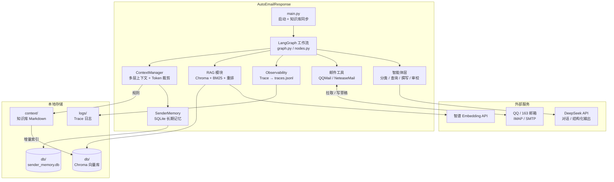
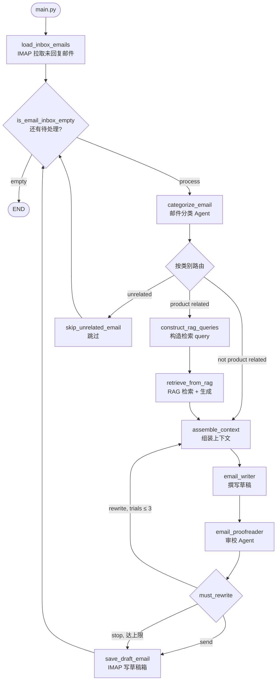

# AutoEmailResponse

基于 LangGraph 的多智能体邮件客服系统。通过 IMAP 拉取待回复邮件，经分类、RAG 检索、上下文组装、撰写与审校后写入草稿箱，**不自动发送**，由人工确认后发出。

适用场景：产品咨询、投诉反馈等邮件客服自动化；知识库当前为心理健康/医疗咨询领域文档，可按需替换。

## 功能特性

- **多智能体流水线**：分类 → RAG（产品咨询）→ 上下文组装 → 撰写 → 审校 ⇄ 重写（≤3 轮）→ 草稿箱
- **邮件接入**：支持 QQ 邮箱、163 邮箱（IMAP 拉取 + APPEND 写草稿）
- **RAG 知识检索**：Chroma 向量库，父子 chunk 索引，支持增量更新；advanced 模式融合向量 + BM25 + RRF + 重排
- **多层上下文**：顶层规则 + 发件人长期记忆（SQLite）+ RAG 结果 + 短期历史，Token 预算裁剪
- **安全边界**：结构化输出（Pydantic）、无关邮件跳过、审校门禁、仅写草稿不自动发信
- **可观测性**：按邮件 trace_id 记录全链路 span、路由决策、RAG 命中，输出至 `logs/traces.jsonl`
- **自动化评测**：检索 Recall@K / MRR，生成 Ragas faithfulness

## 技术栈

Python 3.10+ · LangGraph · LangChain · DeepSeek · 智谱 Embedding · Chroma · SQLite · IMAP · Ragas · rank-bm25

## 系统架构

### 整体架构



### LangGraph 工作流



| 邮件类型 | 处理方式 |
|---------|---------|
| 产品咨询 | RAG 检索 + 生成回复 |
| 投诉 / 反馈 | 直接组装上下文生成回复 |
| 无关邮件 | 跳过 |

## 目录结构

```
AutoEmailResponse/
├── main.py                 # 启动入口
├── requirements.txt
├── .env.example            # 环境变量模板
├── context/
│   ├── company_rules.md    # 全局客服规则（语气、禁止事项等）
│   └── clean_context/      # 知识库 Markdown 源文件
├── src/
│   ├── graph.py            # LangGraph 工作流定义
│   ├── nodes.py            # 节点逻辑
│   ├── agents.py           # LLM 智能体
│   ├── prompts.py          # Prompt 模板
│   ├── tools/              # QQ / 163 邮箱 IMAP 工具
│   ├── context/            # 多层上下文组装
│   ├── memory/             # 发件人长期记忆
│   ├── observability/      # Trace 可观测性
│   └── Rag/                # 向量索引、检索、预处理
├── eval/
│   ├── datasets/           # 评测数据集（rag_eval.jsonl）
│   ├── build_dataset.py    # LLM 合成评估集
│   ├── retrieval_eval.py   # Recall@K / MRR
│   └── ragas_eval.py       # faithfulness 评估
└── db/                     # Chroma + SQLite（本地生成，不入库）
```

## 快速开始

```bash
git clone https://github.com/hairuipile/AutoEmailResponse.git
cd AutoEmailResponse

python -m venv .venv
.venv\Scripts\activate        # Windows
# source .venv/bin/activate   # macOS / Linux

pip install -r requirements.txt
cp .env.example .env          # 填入密钥
python main.py
```

首次运行会自动检测 `context/` 变更并构建/更新向量索引（需配置 `ZHIPUAI_API_KEY`）。

## 环境变量

复制 `.env.example` 为 `.env` 后填写：

| 变量 | 必填 | 说明 |
|------|------|------|
| `DEEPSEEK_API_KEY` | 是 | DeepSeek 对话 API |
| `ZHIPUAI_API_KEY` | 是 | 智谱 Embedding API |
| `MY_EMAIL` | 是 | 邮箱地址 |
| `EMAIL_PROVIDER` | 否 | `qq`（默认）或 `163` |
| `QQ_EMAIL_AUTH_CODE` | qq 时 | QQ 邮箱 IMAP/SMTP 授权码 |
| `NETEASE_EMAIL_AUTH_CODE` | 163 时 | 163 邮箱授权码 |
| `LLM_PROVIDER` | 否 | `DEEPSEEK`（默认）或 `ZHIPUAI` |
| `TRACE_ENABLED` | 否 | 是否开启 Trace，默认 `true` |
| `TRACE_LOG_PATH` | 否 | Trace 日志路径，默认 `logs/traces.jsonl` |

### QQ 邮箱

1. [QQ 邮箱](https://mail.qq.com) → 设置 → 账户 → 开启 IMAP/SMTP
2. 生成授权码 → 填入 `QQ_EMAIL_AUTH_CODE`

```env
EMAIL_PROVIDER=qq
MY_EMAIL=your@qq.com
QQ_EMAIL_AUTH_CODE=your_auth_code
```

### 163 邮箱

1. [163 邮箱](https://mail.163.com) → 设置 → POP3/SMTP/IMAP → 开启服务
2. 生成授权码 → 填入 `NETEASE_EMAIL_AUTH_CODE`

```env
EMAIL_PROVIDER=163
MY_EMAIL=your@163.com
NETEASE_EMAIL_AUTH_CODE=your_auth_code
```

## 核心模块

### 智能体工作流（LangGraph）

| 节点 | 说明 |
|------|------|
| `categorize_email` | 识别产品咨询 / 投诉 / 反馈 / 无关 |
| `construct_rag_queries` | 从邮件提取检索 query（最多 3 条） |
| `retrieve_from_rag` | 两步式 RAG：检索 → 基于 context 生成答案 |
| `assemble_context` | 多层上下文组装 + Token 裁剪 |
| `email_writer` | 结构化输出撰写回复 |
| `email_proofreader` | 审校准确性/语气/质量，不通过则重写 |
| `save_draft_email` | IMAP APPEND 写入草稿箱 |

### RAG 检索

- **baseline**：Chroma 向量相似度检索
- **advanced**：向量 + BM25 → RRF 融合 → cosine 重排 → 父子 chunk 回填 → 智能拼装（上限约 2800 字）

### 长期记忆

SQLite 存储发件人历史交互 episode，按 query 相关性检索，注入上下文供后续回复参考。

### 可观测性

每条邮件分配独立 `trace_id`，各节点记录 span 耗时、分类结果、RAG 命中、审校反馈等，便于逐步排查。

查看 Trace：

```bash
# 日志位于 logs/traces.jsonl，每行一条 JSON
type logs\traces.jsonl        # Windows
# tail -f logs/traces.jsonl   # Linux/macOS
```

## 评测

仓库已包含 `eval/datasets/rag_eval.jsonl`（30 条），clone 后可直接评测。需先运行 `python main.py` 构建本地向量库。

```bash
# 可选：重新合成评估集（消耗 API）
python eval/build_dataset.py --limit 30

# 检索评测：Recall@3 / MRR，对比 baseline vs advanced
python eval/retrieval_eval.py

# 生成评测：Ragas faithfulness（消耗 API，建议加 --limit 控制成本）
python eval/ragas_eval.py --retriever baseline --limit 5
```

评测结果写入 `eval/results/`（已 gitignore，不上传）。

## 自定义

1. **知识库**：在 `context/clean_context/` 添加或修改 Markdown，重启 `main.py` 自动增量索引
2. **客服规则**：编辑 `context/company_rules.md`，配置语气、禁止承诺、信息安全等约束
3. **Prompt**：修改 `src/prompts.py` 调整各智能体行为

## 注意事项

以下内容已在 `.gitignore`，不会也不应提交：

- `.env`（API 密钥、邮箱授权码）
- `db/`（向量库，clone 后本地构建）
- `logs/`、`eval/results/`、`metadata_cache.json`
