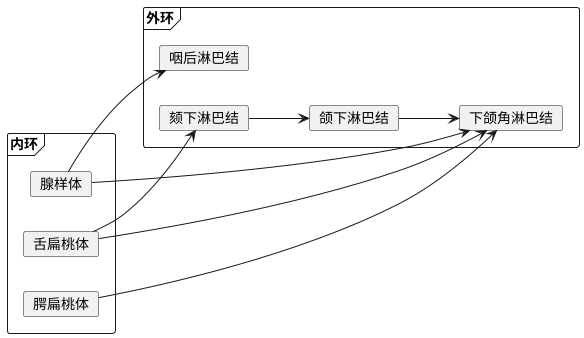

<!--
  original_source: main.md
  h1_title: 咽科学
-->
# 咽科学
## 咽解剖
1. 颈部筋膜间隙：其他间隙见[局部解剖学](../TopoAna/main.md#颈部)
- 咽后隙
- 位置
- 上：颅底
- 下：上纵隔
- 前：颊咽筋膜
- 后：椎前筋膜
- 功能：扁桃体、口腔、鼻腔后部、鼻咽、咽鼓管、鼓室淋巴引流处
- 咽旁隙
- 位置
- 上：颅底
- 下：舌骨
- 内：颊咽筋膜、咽缩肌
- 外：下颌骨升支、腮腺深面、翼内肌
- 后：椎前筋膜
- 功能
- 后隙：颈内AV、颅神经 IX, X, XI, XII、交感神经干、颈深淋巴结上群。扩散多见咽部炎症
- 前隙：颈外AV，扩散多见扁桃体炎症  
1. 咽部淋巴回流 <!--IMPORTANT-->  

## 咽炎
### 急性咽炎
1. 临床表现：急性起病 <!--IMPORTANT-->
- 症状
- 局部症状：咽部干燥灼热、咽痛，吞咽时明显，咽侧索受累时可放射至耳部
- 全身症状：较轻
- 无并发症者 1 wks 内自愈
- 体征
- 口咽部黏膜急性弥漫性充血、肿胀
- 咽后壁淋巴滤泡隆起，表面可见黄白色点状渗出
- 悬雍垂及软腭水肿
- 下颌下淋巴结肿大、压痛  
1. 并发症 <!--IMPORTANT-->
- 中耳炎
- 鼻窦炎
- 呼吸道急性炎症
- 急性脓毒性咽炎：急性肾炎、风湿热、败血症  
### 慢性咽炎
1. 病理 <!--IMPORTANT-->
- 慢性单纯性咽炎
- 慢性肥厚性咽炎
- 萎缩性咽炎与干燥性咽炎  
1. 临床表现
- 无明显全身症状
- 咽部异物感、痒感、灼热感、干燥感或微痛感
- 晨起出现频繁的刺激性咳嗽，伴恶心
- 无痰或颗粒状藕粉痒分泌物痰
- 咽后壁黏稠分泌物附着  
1. 治疗
- 病因治疗
- 中成药
- 局部治疗
- 慢性单纯性咽炎：含漱液
- 慢性肥厚性咽炎：含漱、物理治疗  
## 扁桃体炎
### 概述
1. 扁桃体重要结构
- 半月襞：腭舌弓与腭咽弓相交处上端
- 三角襞：腭舌弓向下延伸包绕扁桃体前下部  
1. 血供
- 动脉：颈外动脉分支
- 静脉：经扁桃体周围静脉丛至颈内静脉  
### 急性扁桃体炎
1. 特点：多见春秋季节  
1. 病因：主要为乙型溶血性链球菌，可为病毒或其他各型细菌感染 <!--IMPORTANT: 选择-->  
1. 临床分类
- 急性卡他性扁桃体炎：多为病毒引起，扁桃体黏膜表面炎症
- 急性化脓性扁桃体炎
- 急性滤泡性扁桃体炎：淋巴滤泡炎症，引起扁桃体充血、肿胀、化脓。隐窝口间黏膜下可见黄白色斑点
- 急性隐窝性扁桃体炎：扁桃体隐窝内炎症，可有渗出物自窝口排出  
1. 临床表现 <!--IMPORTANT-->
- 症状
- 全身症状：急性感染症状，多见急性化脓性扁桃体炎
- 剧烈咽痛，常放射至耳部，可伴吞咽困难
- 体征
- 扁桃体肿大：金葡菌感染者明显，可伴呼吸困难
- 扁桃体表面或隐窝口处可见豆渣样渗出物
- 下颌下淋巴结肿大  
1. 鉴别诊断 <!--IMPORTANT-->
- 咽白喉：咽部坚韧灰白色假膜，不易擦去，可有“牛颈”状颈淋巴结肿大，白喉杆菌 (+)
- 樊尚咽峡炎：多见单侧，扁桃体灰色或黄色假膜，下有溃疡，樊尚螺旋菌、梭形杆菌 (+)
- 白血病性咽峡炎：无咽痛，全身淋巴结肿大，急性期体温升高，早期出现全身性出血、白细胞增多  
1. 并发症 <!--Somewhat IMPORTANT-->
- 局部并发症
- 急性中耳炎
- 急性鼻窦炎
- 急性喉炎
- 急性淋巴结炎
- 咽旁脓肿
- 全身并发症：全身性细菌感染  
1. 治疗
- 一般治疗：适当隔离、休息、流质饮食、多饮水
- 抗生素应用：首选青霉素
- 局部治疗：含漱液
- 手术治疗：已有并发症者，急性炎症消退后行扁桃体切除术  
### 慢性扁桃体炎
1. 病因：主要为链球菌、金葡菌  
1. 临床表现
- 病史
- 急性扁桃体炎发作史
- 邻近组织感染，风湿性关节炎、风湿热、心脏病、肾炎等
- 咽痛
- 易感冒
- 口臭：扁桃体隐窝内腐败物潴留、厌氧菌感染
- 呼吸不畅、鼾、吞咽困难、言语障碍：扁桃体过度肥大  
1. 鉴别诊断
- 扁桃体生理性肥大：隐窝口清洁，无分泌物
- 扁桃体角化症：隐窝口上皮白色尖形坚硬沙砾样物，不易擦拭
- 扁桃体肿瘤：多见单侧扁桃体迅速增大，可伴溃疡，常伴同侧颈淋巴结肿大  
1. 治疗
- 非手术治疗：免疫疗法，中医中药，加强体质
- 手术治疗：[扁桃体切除术](#扁桃体切除术)  
### 扁桃体周围脓肿
<!--IMPORTANT-->  
1. 临床表现
- 急性扁桃体炎发作 3 - 4 天后
- 病情加重（发热、咽痛）、吞咽困难
- 急性面容，头偏患侧  
1. 诊断：穿刺抽脓  
1. 鉴别诊断 <!--IMPORTANT: 案例分析-->
- 咽旁间隙脓肿
- 第三磨牙冠周炎  
1. 治疗 <!--TODO: Add -->
- 脓肿形成前：同急性扁桃体炎
- 脓肿形成后：切开排脓  
### 扁桃体切除术
1. 适应证 <!--IMPORTANT: 问答-->
- 慢性扁桃体炎反复急性发作，或多次并发扁桃体周脓肿
- 扁桃体过度肥大，妨碍吞咽、呼吸、言语
- 慢性扁桃体炎引起邻近部位病变
- 白喉带菌者，经保守治疗无效
- 合并扁桃体良性肿瘤  
1. 禁忌症 <!--IMPORTANT: 问答-->
- 急性炎症（一般建议炎症消退后 2 - 3 wks）
- 造血系统疾病，伴凝血障碍者
- 严重全身性疾病
- 急性呼吸道传染病患病期间或流行期间
- 合并经前、经期、妊娠者
- 患者亲属中 Ig 缺乏或自身免疫病发病率高、WBC 低者  
1. 术式
- 扁桃体剥离术
- 扁桃体挤切术：多用于儿童扁桃体肥大者  
1. 术后处理
- 体位：全麻未苏醒者俯卧位头稍低而侧，苏醒后平卧
- 饮食：全麻苏醒后 4 - 6 hrs 可进食，首日冷流质，次日半流质，一周后软食，10 天后正常
- 注意出血：术后 24 hrs 易出血，注意出血后吐出，及时咽部检查止血
- 创口白膜：正常反应，保护作用，5 - 7 天脱落
- 创口疼痛：术后 24 hrs 明显，镇静止痛药
- 口腔卫生：术后 24 hrs 开始漱口液漱口
- 控制感染：如并发邻近部位病变  
## 腺样体肥大
1. 腺样体面容：长期张口呼吸影响面骨发育，出现上颌骨变长、腭骨高拱、牙列不齐、上切牙突出、唇厚、缺乏表情的面容 <!--IMPORTANT: 名解-->  
## 咽部脓肿
### 咽后脓肿
1. 临床表现
- 急性型：多见 3 y/o 以下婴幼儿咽后隙化脓性淋巴结炎
- 急性起病，感染症状
- 吞咽、言语困难、拒食
- 呼吸困难：可伴鼾、入睡时加重，多呈吸入性呼吸困难
- 慢性型：咽后隙淋巴结结核或颈椎结核形成的寒性脓肿所致
- 结核病表现
- 咽部阻塞感
- 检查：注意检查时脓肿破裂须将患儿头部朝下，以防吸入窒息
- 咽后壁一侧隆起，黏膜充血，可有腭咽弓和软腭前移
- 位置
- 外伤或异物：喉咽部
- 颈椎结核：咽后壁中央
- 患侧或双侧颈淋巴结肿大  
1. 治疗
- 急性型：早期切开排脓（仰卧低头位）
- 结核性：抗结核治疗，穿刺抽脓并注入链霉素  
## 咽肿瘤
### 鼻咽纤维血管瘤
1. 鼻咽纤维血管瘤：由致密结缔组织、大量弹性纤维及血管组成，多见青年男性。鼻咽部最常见良性肿瘤。 <!--IMPORTANT: 名解-->  
1. 特征：极易出血，禁忌活检  
1. 临床表现
- 出血：（常见首诊主诉）阵发性鼻腔或口腔出血，可伴贫血
- 鼻塞：肿瘤堵塞后鼻孔并侵入鼻腔，常伴流鼻涕、闭塞性鼻音、嗅觉减退
- 其他症状：邻近组织压迫症状（眼球突出、视力下降、外鼻畸形、颅神经压迫症状等）
- 检查
- 前鼻镜：鼻腔炎性改变，收缩下鼻甲后可见鼻腔后部粉红色肿瘤
- 鼻咽镜：鼻咽部圆形或分叶状红色肿瘤，表面光滑富有血管
- 影像学检查  
1. 诊断  
1. 鉴别诊断
- 后鼻孔出血性息肉
- 鼻咽部脊索瘤
- 鼻咽部恶性肿瘤  
1. 治疗：一般考虑手术治疗，术前不建议活检（易出现大出血）  
### 鼻咽癌
<!--IMPORTANT--> <!--IMPORTANT-->  
1. 鼻咽癌：鼻咽部黏膜上皮发生的癌症，多属低分化鳞状细胞癌。 <!--IMPORTANT-->  
1. 特点：多见 40 - 50 y/o 男性，咽隐窝及顶后壁多发，多为低分化鳞癌  
1. 临床表现 <!--IMPORTANT: 大题-->
- 症状
- 鼻部症状
- 早期回缩血涕或擤鼻涕中带血
- 鼻塞：瘤体增大
- 耳部症状
- 肿瘤侧耳鸣、耳闭塞感、听力下降
- 分泌性中耳炎：长期难以治愈的中耳炎
- 颈淋巴结肿大（常见首发症状）
- 颅神经压迫症状：多见 II - VI
- 远处转移灶症状
- 检查
- 间接鼻咽镜
- 早期：黏膜充血、血管怒张、单侧咽隐窝较饱满
- 小结节状或肉芽肿样隆起，表面粗糙不平，易出血
- 颈部触诊：无痛性肿大淋巴结，活动差，质硬
- EB 病毒血清学试验
- 影像学检查  
1. 确诊：活检  
1. 鉴别诊断
- 淋巴结结核
- 霍奇金淋巴瘤  
1. 治疗：首选放疗 <!--IMPORTANT--> <!--IMPORTANT-->  
## 阻塞性睡眠呼吸暂停低通气综合征
<!--IMPORTANT--> <!--IMPORTANT-->  
1. 阻塞性睡眠呼吸暂停低通气综合征 (OSAHS)：睡眠时上气道塌陷阻塞引起的呼吸暂停与低通气，通常伴打鼾、睡眠结构紊乱、频繁发生 SO2 下降、白天嗜睡、注意力不集中等症状，并可导致高血压、冠心病、糖尿病等系统损害 <!--IMPORTANT: 名解-->  
1. 睡眠呼吸暂停低通气指数 (AHI)：睡眠过程中平均每小时呼吸暂停与低通气的总次数 <!--IMPORTANT: 名解-->  
1. 病因 <!--IMPORTANT-->
- 上气道解剖结构异常
- 鼻腔及鼻咽腔狭窄
- 口咽腔狭窄
- 喉咽及喉腔狭窄
- 上/下颌骨畸形或发育不良
- 上气道扩张肌肌张力异常
- 呼吸中枢调节功能异常
- 其他：某些全身因素  
1. 临床表现 <!--IMPORTANT-->
- 睡眠打鼾与呼吸暂停，可伴夜间憋醒
- 白天嗜睡
- 记忆力减退、注意力不集中、反应迟钝
- 晨起口干、咽喉异物感、晨起后头疼、血压升高
- 可有性功能障碍、夜尿增加、遗尿
- 性格改变  
1. 诊断：多导睡眠监测 (PSG)，结合临床症状 <!--IMPORTANT-->  
1. 治疗：个体化多学科综合治疗 <!--IMPORTANT-->
- 一般治疗：运动、减肥、戒烟戒酒、侧卧睡眠
- 非手术治疗
- 调整睡眠姿势
- 无创气道正压通气 (CPAP)
- 口腔矫治器：下颌向前牵拉
- 药物治疗：疗效不肯定
- 手术治疗：依赖于狭窄与梗阻平面
- 去除病因
- 悬雍垂腭咽成形术 (UPPP)
- 舌体消融术