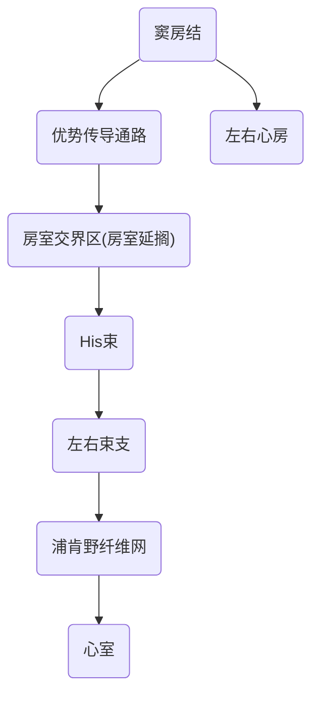
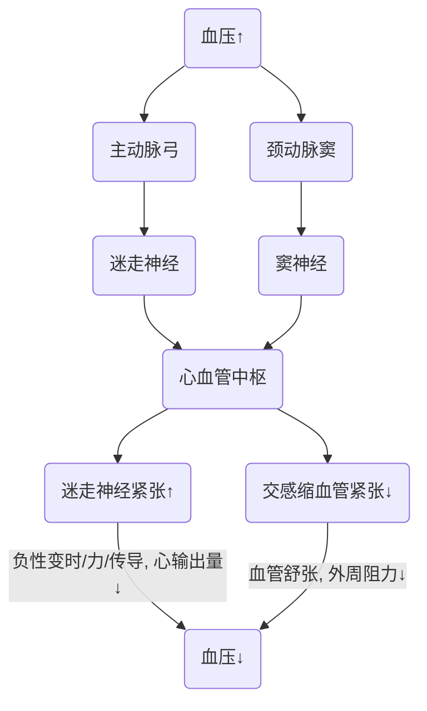
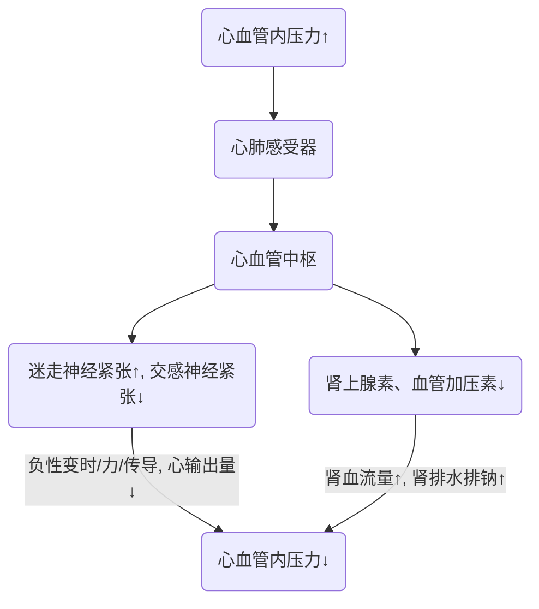

<!--
  original_source: main.md
  h1_title: 循环系统
-->
# 循环系统
## 心脏的生物电活动
1. 心肌细胞分类
- 按0期去极速度的快慢
+ 慢反应细胞: 窦房结P细胞、房结区和结希区细胞
+ 快反应细胞: 心房肌、心室肌细胞、蒲肯野细胞
- 按4期自动去极的有无
+ 工作细胞: 心房肌、心室肌细胞
+ 自律细胞: 组成心脏的特殊传导系统
1. 两种离子通道的比较 <!--TODO: Maybe add graph on pp82-83-->  
### 心肌细胞的跨膜电位及其形成机制
#### 心室肌细胞 (快反应工作细胞)
- 静息电位
- 动作电位  
快反应细胞动作电位分期变化
```
+------+------+--------------+--------------------+--------------+-------------------+
|  AP  | 分期 |     名称     |      电位变化      |   形成机制   |       通道        |
+======+======+==============+====================+==============+===================+
| 去极 |  0   |  快速去极期  |     -90 ~ 30mV     |  快Na+内流   |     快Na+通道     |
+------+------+--------------+--------------------+--------------+-------------------+
|      |  1   | 快速复极初期 |      30 ~ 0mV      |    K+外流    |      IK通道       |
|      +------+--------------+--------------------+--------------+-------------------+
|      |      |              |                    |   Ca2+内流   |                   |
|      |  2   |    平台期    | 0mV左右,持续时间长 +--------------+ I(Ca-L),I(Na)通道 |
|      |      |              |                    |    K+外流    |                   |
| 复极 +------+--------------+--------------------+--------------+-------------------+
|      |  3   | 快速复极末期 |     0 ~ -90mV      | Ca2+内流停止 |    IK,IK1通道     |
|      +------+--------------+--------------------+--------------+-------------------+
|      |      |              |                    |   Na+-K+泵   |                   |
|      |  4   |    静息期    | -90mV,恢复离子分布 +--------------+                   |
|      |      |              |                    |  Na+-Ca2+泵  |                   |
+------+------+--------------+--------------------+--------------+-------------------+
```
#### 自律细胞
自律细胞AP特点及形成机制  
|  跨膜电位  |      窦房结细胞 (慢反应)     |  浦肯野细胞 (快反应) |
|:----------:|:----------------------------:|:--------------------:|
|    分期    |           0、3、4            |        0 ~ 4         |
|最大复极电位|            -70mV             |        -90mV         |
|   阈电位   |            -40mV             |        -70mV         |
|  0 期去极  |    速度慢, 幅度小, 时程长    |速度快, 幅度大, 时程短|
|4 期自动去极|              快              |          慢          |
|4 期形成机制|主要为K+外流, 后程出现Ca2+内流|    主要为Na+内流     |
|0 期形成机制|          慢Ca2+内流          |      快Na+内流       |  
### 心肌的电生理特征
#### 兴奋性
1. 影响因素
1. 特点
- 心肌的有效不应期很长
1. 周期性变化  
|   名称   |     时间&电位     |兴奋性|         反应         |  $Na^+$通道  |
|:--------:|:-----------------:|:----:|:--------------------:|:------------:|
|绝对不应期| 0期->复极3期-55mV |  无  |         全无         |   完全失活   |
|局部反应期|复极3期-55mV->-60mV|  无  |  强刺激仅有局部反应  |   少量复活   |
|相对不应期|复极3期-60mV->-80mV|<正常 | 阈上刺激产生低幅度AP |  大部分复活  |
|  超常期  |复极3期-80mV->-90mV|>正常 |阈下刺激产生稍低幅度AP|基本复活至备用|  
#### 自律性
1. 定义: 心肌在没有外来刺激的情况下可以自动的发生节律性兴奋,
心肌各部分节律性存在差别.
2. 心脏起搏点
- 正常起搏点=窦房结细胞
- 潜在起搏点
+ 房室交界自律性
+ His束
+ 末梢浦肯野纤维网
- 异位起搏点
3. 控制机制
- 抢先占领
- 超速驱动抑制
4. 影响因素
- 4期自动去极化速率
- 最大复极电位与阈电位差距  
#### 传导性
1. 机制: 兴奋以局部电流的方式通过闰盘
2. 传导途径:  

#### 收缩性
1. 特点
- 同步收缩
- 不会发生完全强制收缩
- 心肌对细胞外Ca2有依赖性  
### 体表心电图
1. 意义: 反应心脏兴奋的产生、传导和兴奋恢复过程中的综合生物电变化.
2. 正常心电图波形及其意义  
|心电图波形|             意义             |
|:--------:|:----------------------------:|
|    P     |  反映左右两心房的去极化过程  |
|   QRS    |  反映左右两心室的去极化过程  |
|    T     |  反映左右两心室的复极化过程  |
|    U     |可能与浦肯野纤维网的复极化有关|  
## 心脏的泵血功能
### 心脏收缩性的特点
1. 心肌对细胞外Ca2+的依赖大
- 原因: 心肌肌浆网不发达, 储钙少. 收缩主要依靠AP平台期的外Ca2+内流,
进而触发肌浆网大量释放Ca2+, 可以只产生AP而不收缩.
2. 心肌的有效不应期很长
- 作用: 不会发生完全强制收缩
3. 心肌呈" 全或无" 式收缩  
### 心脏泵血的过程和机制
1. 心动周期
1. 心房: 0.1s
2. 心室: 心房舒张后0.3s
3. 全心舒张期: 0.4s
1. 特点:
- 心房收缩在前, 心室收缩在后
- 左右心房/室同步收缩  
#### 泵血过程
1. 心室收缩期 (0.3s)
- 等容收缩期
+ 心室第一次密闭
+ 室内压升高最快
+ 心室容积最大, 保持不变
- 快速射血期: 动脉瓣开->房室瓣关
+ 占射血量2/3
- 减慢射血期
1. 心室舒张期 (0.5s)
- 等容舒张期
+ 心室第二次密闭
+ 室内压下降最快
+ 心室容积最小
- 快速充盈期: 动脉瓣关->房室瓣开
+ 占充盈量2/3
- 减慢充盈期
- 心房收缩期
1. 心房收缩 (初级泵) 的作用
- 进一步增加心室的容积和压力, 有利于心室充盈
- 心房舒张时接纳和储存静脉回流的血液  
#### 泵血功能评价指标
1. **心脏的输出量**
- 每搏输出量, 正常为70ml.
- 射血分数: $frac{搏出量}{心室舒张末期的容积}$, 正常为60%.
- 每分输出量(心排出量): 搏出量 * 心率, 正常为5 ~ 6L
- 心指数: $frac{每分输出量}{体表面积}$, 正常为3.0～3.5L/(min·m²).
1. 心脏做功量
- 每搏功
+ 压强能 (主要)
+ 动能
- 每分功
- 心脏的效率  
## 心输出量的影响因素
1. 前负荷 (心肌初长度, 心泵功能的自身调节)
- 含义: 心室舒张末期的容积/压力
- 心泵功能的异长自身调节
- 取决因素:
- 心率
- 静脉与心房心室压力差
- 心肌收缩力
- 心房收缩力
1. 异长自身调节 (Starling机制)
- 生理意义: 使心室射血量与静脉回心血量之间保持平衡
1. 心肌收缩能力 (等长自身调节)
- 影响因素: 兴奋收缩耦联
1. 后负荷 (动脉血压)
- 含义: 心室肌收缩射血后遇到的动脉血压
1. 心率
- 心输出量: 搏出量 * 心率  
## 血管生理
### 血管概述  
|  血管分类  |     构成     |                  作用                  |
|:----------:|:------------:|:--------------------------------------:|
|弹性贮器血管|    大动脉    |缓冲动脉血压, 使动脉射血转变为持续性血流|
|  分配血管  |    中动脉    |                                        |
|  阻力血管  |小动脉、微动脉|   参与形成外周阻力, 微动脉有闸门作用   |
|  交换血管  |  真毛细血管  |                物质交换                |
|  容量血管  |     静脉     |                贮存血液                |  
### 动脉血压
1. 定义: 主动脉或大动脉内血液的压强
- 收缩压: 心室收缩, 心室收缩动脉压升高达到的最大值
- 舒张压: 心室舒张, 心室舒张动脉压降低达到的最小值
- 脉搏压 (脉压) : 收缩压 - 舒张压
- 平均动脉压: 舒张压 + 1/3 脉压: 1/3 收缩压 + 2/3 舒张压  
1. 形成条件
- 前提: 循环系统有足够的血液充盈
- 心脏射血
- 外周阻力  
1. 血压测量 <!--TODO: add-->  
1. **影响动脉血压的因素**
- 每搏输出量
+ 收缩压↑ 为主, 脉压↑
- 心率
+ 舒张压↑ 为主, 脉压↓
- 外周阻力
+ 舒张压↑ 为主, 脉压↓
- 主动脉、大动脉的弹性贮器作用
+ 动脉弹性↓  (大动脉硬化) : 收缩压↑ , 舒张压↓ , 脉压↑↑
+ 动脉硬化 (大、小动脉硬化) : 收缩压↑↑ , 舒张压↑ , 脉压↑
- 循环血量与血管系统容量的比例
+ 循环血量↓ : 血压↓
+ 血管容积↑ : 血压↓
+ 循环血量↑ /血管容积↓ : 血压↑  
### 静脉血压
1. 组成
- 中心静脉压 (CVP)
+ 定义: 右心房和胸腔内大静脉的血压
+ 正常值: 4～12 cmH₂O
- 外周静脉压
2. 回心血量的影响因素
- 体循环平均充盈压
- 心脏收缩力量
- 体位: 重力影响
- 骨骼肌挤压作用: 肌肉泵
- 呼吸运动: 呼吸泵  
### 微循环
1. 定义: 微动脉和微静脉之间的血液循环
1. 组成
- 微动脉：调节血压、控制血流。阻力血管
- 后微动脉
- 真毛细血管：通透性大，进行物质交换
- 直捷通路：多见于骨骼肌，保证静脉回心血量
- 动静脉短路：调节体温，多见于皮肤
- 微静脉：调节毛细血管血压，调节静脉回心血量
1. 途径
- 迂回通路 (营养通路) : 进行物质交换
- 直捷通路: 多存在于骨骼肌内部
- 动静脉短路: 参与体温调节, 多存在于皮肤  
### 组织液生成
1. 性状: 胶冻状
1. *有效滤过压 (EFP)*
- 滤过 (生成, 动力)
+ 毛细血管压
+ 组织液胶体渗透压
- 重吸收 (回流/重吸收, 阻力)
+ 组织液静水压
+ 血浆胶体渗透压
1. 影响因素
- 有效滤过压
- 血浆胶体渗透压
- 毛细血管壁通透性
- 淋巴回流  
### 淋巴循环
1. 意义
- 回收组织蛋白 (75 - 200 g/day)
- 运输脂肪等营养物质
- 调节血浆和组织液间液体平衡
- 清除组织中红细胞、细菌
- 淋巴结  
## 心血管活动的调节
### 神经调节
#### 心脏和血管的神经支配
1. 心交感神经
- 支配: 整个心脏
- 递质: NE
- 机制: 节后神经纤维释放NE作用于β1受体, 促进Ca2+内流
- 作用: 正性变时 (心率), 变力 (心肌收缩力), 变传导 (心传导系传导速度)
2. 心迷走神经 (优势)
- 支配: 心传导系与心房肌
- 递质: ACh
- 机制: 节后神经纤维释放ACh作用于M受体, 促进K+外流, 抑制Ca2+内流
- 作用: 负性变时 (心率), 变力 (心肌收缩力), 变传导 (心传导系传导速度)
3. 交感缩血管神经
- 支配: 除毛细血管外所有血管
- 分布密度: 皮肤&内脏>脑血管,
同一器官中微动脉>其他血管
- 递质: NE
- 机制: 节后神经纤维释放NE作用于α受体, 促进血管收缩
4. 交感舒血管神经
- 支配: 骨骼肌微动脉
- 递质: ACh
- 机制: 节后神经纤维释放ACh作用于M受体
5. 副交感舒血管神经
- 支配: 少数器官
- 递质: ACh
- 机制: 节后神经纤维释放ACh作用于M受体  
#### 心血管中枢
各级都有, 延髓为主.  
#### 心血管反射
1. 降压反射
- 特点: 对高血压患者无明显效果
- 生理意义: 保持短期动脉血压相对稳定  

2. 心肺感受器反射
- 部位: 心房、心室、肺循环大血管壁
- 刺激:
+ 血容量↑, 血压↑等机械牵张刺激
+ 前列腺素等化学刺激  

3. 增压反射 (化学感受器反射)
见[呼吸](化学感受性呼吸反射)  
### 体液调节
#### 肾素、血管紧张素系统
1. 组成
2. 功能: 调节水盐平衡和血压. 血量、血压减少时维持器官血流.
3. 血管紧张素II的生理作用
- 使微动脉 (增加外周阻力) 与微静脉 (增加静脉回心血量) 收缩, 增加动脉血压.
- 使交感缩血管神经中枢紧张性增加, 增加NE释放量.
- 增加渴觉
- 促进肾对水钠的吸收
- 促进ADH, ACTH的释放 <!--TODO: ??-->  
#### 肾上腺素与去甲肾上腺素
1. 来源: 主要为肾上腺髓质, 极少NE来自交感神经末梢
2. 效应
- α受体 (皮肤、内脏) : 缩血管, 升血压
- β₁受体 (心肌) : 正性变
- β₂受体: 扩张支气管, 舒张骨骼肌/肝血管  
|     \      |        E         |    NE    |
|:----------:|:----------------:|:--------:|
|兴奋受体能力|    α 强, β 强    |α 强, β 弱|
|  兴奋心脏  |        强        |    弱    |
|    血管    |部分舒张, 部分收缩| 全体收缩 |
|  外周阻力  |     变化不大     |   增加   |
|    血压    |  收缩压↑, 脉压↑  |    ↑     |
|  临床作用  |       强心       |   升压   |  
#### 其他激素  
### 局部血流调节
1. 代谢性自身调节: 代谢产物↑ -> 局部血流↑ -> 带走代谢产物
2. 肌源性自身调节: 血压↑ -> 血管紧张性↑ -> 维持器官血流量稳定  
### 动脉血压的长期调节
<!--TODO: ref kidney-->  
## 器官循环
### 冠脉循环
1. 冠脉血流特点
- 冠脉血压高
- 冠脉血流量大
- 冠脉血流量与舒张期呈正相关, **与动脉舒张压呈负相关**
1. 冠脉血流量的调节
- **心肌代谢水平**: 心肌活动↑ 使代谢产物↑, 冠脉舒张, 冠脉血流量↑
- 神经调节
+ 迷走神经兴奋: 冠脉舒张与心肌代谢减少导致的冠脉收缩抵消
+ 交感神经兴奋: 冠脉收缩被心肌代谢增加导致的冠脉舒张掩盖
- 体液调节
+ 肾上腺素类: 心肌代谢↑ -> 冠脉舒张
+ 甲状腺素: 冠脉舒张
+ 血管紧张素: 冠脉收缩