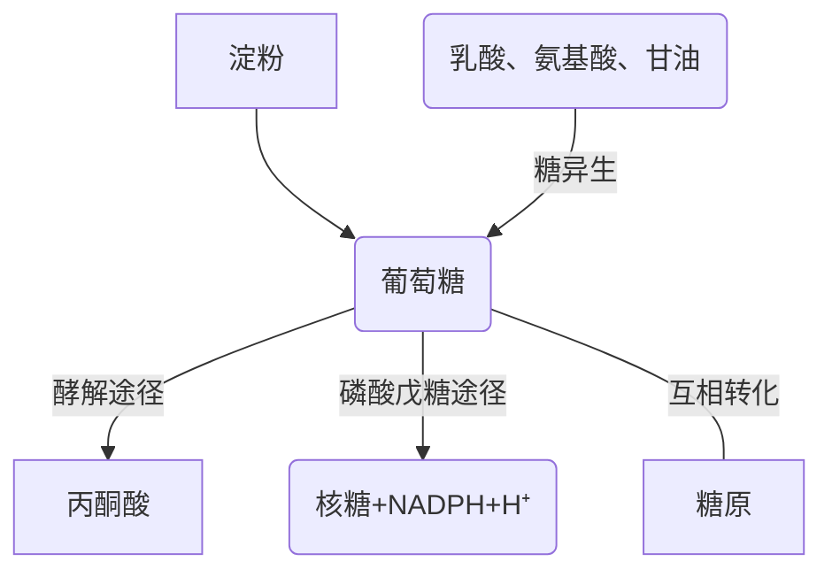

<!--
  original_source: main.md
  h1_title: 糖代谢
-->
# 糖代谢
## 糖的消化, 吸收与转运
0. 吸收机制: Na+依赖型葡萄糖转运体 (SGLT)
0. 吸收途径: 葡萄糖转运体 (GLUT)
0. 糖代谢概况

## 糖的无氧酵解
0. **定义**: 在缺氧条件下, 葡萄糖或糖原分解生成乳酸并释放能量的过程.
0. 反应部位: 胞浆
0. 基本过程
- [ATP->ADP, 己糖激酶]glu --> g6p
- g6p === f6p
- [ATP->ADP, 磷酸果糖激酶]f6p --> f162p
- [醛缩酶]f162p --> 磷酸二羟丙酮, 3-磷酸甘油醛
- 磷酸二羟丙酮 === 3-磷酸甘油醛
- [NAD⁺->NADH]3-磷酸甘油醛 --> 1,3-二磷酸甘油酸
- [ADP->ATP, 磷酸甘油酸激酶]1,3-二磷酸甘油酸 --> 3-磷酸甘油酸
- 3-磷酸甘油酸 --> 2-磷酸甘油酸
- 2pga --> PEP
- [ADP->ATP, 丙酮酸激酶]PEP --> 丙酮酸
- [NAD⁺->NADH, 乳酸脱氢酶(LDH)]丙酮酸 --> 乳酸  
0. 三个关键酶(不可逆)
- 己糖激酶
- 果糖磷酸激酶 (限速酶, 最主要调节点)
+ ADP等底物 增多 -> 激活
+ ATP等产物 增多 -> 抑制
- 丙酮酸激酶
0. 总反应式: 葡萄糖 -> 2 * 乳酸+2 * ATP
0. 底物: 糖原、葡萄糖
0. 产物: 乳酸、ATP
0. 中间产物: 葡萄糖与丙酮酸间皆为磷酸化合物
0. 葡萄糖激酶 (肝内IV型己糖激酶) 特点
- 己糖激酶同工酶共4种
- 对葡萄糖亲和力低
- 受激素调控
0. 生理意义
- 快速提供能量
- 是某些细胞在有氧条件下的重要功能途径
+ 无线粒体细胞: 红细胞
+ 代谢活跃细胞: 白细胞、骨髓细胞
- 有氧氧化前段  
## 糖的有氧氧化
0. 定义: 有氧条件下, 葡萄糖或糖原氧化成CO2和H2O的过程.
0. 基本过程
- 糖酵解
- 丙酮酸氧化脱羧生成乙酰CoA  
: "丙酮酸 + HS-CoA" -- "丙酮酸脱氢酶复合体, NAD" --> "CO2 + NADH + 乙酰CoA"  
- 柠檬酸(TAC)循环
- 氧化磷酸化
0. 丙酮酸氧化脱羧
- 总反应: [NAD->NADH+H⁺] 丙酮酸 -- 丙酮酸脱氢酶复合体+CoA --> 乙酰CoA
- 场所: 线粒体内膜
- 分反应
+ α-羟乙基-TPP的生成
+ 乙酰硫辛酰胺生成
+ 乙酰CoA生成
+ 硫辛酰胺生成
+ NADH + H⁺
0. 三羧酸循环
- 草酰乙酸+乙酰CoA -- 柠檬酸合酶 --> 柠檬酸
- 异构, 氧化脱羧
+ 柠檬酸 -- 顺乌头酸酶 --> 异柠檬酸
+ [NAD->NADH+H⁺] 异柠檬酸 -- 异柠檬酸脱氢酶 --> α-酮戊二酸
+ [NAD->NADH+H⁺, CO₂] 戊二酸 -- α-酮戊二酸脱氢酶复合体+CoA --> 琥珀酰CoA
+ [底物水平磷酸化: GDP->GTP] 琥珀酰CoA -- 琥珀酰CoA合成酶 --> 琥珀酸
- 草酰乙酸的再生
+ [FAD->FADH₂] 琥珀酸 -- 琥珀酸脱氢酶 --> 延胡索酸
+ 延胡索酸 -- 延胡索酸酶 --> 苹果酸
+ [NAD->NADH+H⁺] 苹果酸 -- 苹果酸脱氢酶 --> 草酰乙酸
0. 关键酶 (不可逆)
- 柠檬酸合酶
- 异柠檬酸脱氢酶
- α-酮戊二酸脱氢酶复合体
0. 生理意义
- 葡萄糖 -> (5-7 + 5 + 20)=(30-32)ATP  
|             反应步骤             | 辅酶 |    ATP     |
|:--------------------------------:|:----:|:----------:|
|       葡萄糖->6-磷酸葡萄糖       |      |     -1     |
|    6-磷酸果糖->1,6-二磷酸果糖    |      |     -1     |
|2×3-磷酸甘油醛->2×1,3-二磷酸甘油酸|2NADH |            |
|2×1,3-二磷酸甘油酸->2×3-磷酸甘油酸|      |    2×1     |
|   2×磷酸烯醇式丙酮酸->2×丙酮酸   |      |    2×1     |
|        **第一阶段(胞浆)**        |      |   **2**    |
|   2×丙酮酸&NADH+H+穿梭入线粒体   |      |2×2.5或2×1.5|
|    2×丙酮酸->2×乙酰CoA 2NADH     |2NADH |   2×2.5    |
|     **第二阶段(线粒体基质)**     |      | **8或10**  |
|     2×异柠檬酸->2×α-酮戊二酸     |2NADH |   2×2.5    |
|    2×α-酮戊二酸->2×琥珀酰CoA     |2NADH |   2×2.5    |
|      2×琥珀酰CoA->2×琥珀酸       |      |    2×1     |
|       2×琥珀酸->2×延胡索酸       |2FADH2|   2×1.5    |
|       2×苹果酸->2×草酰乙酸       |2NADH |   2×2.5    |
|       **第三阶段(线粒体)**       |      |   **20**   |
|     **由一个葡萄糖总共获得**     |      |   30或32   |  
### 巴斯德效应
- 概念: 有氧氧化抑制糖酵解
- 机制: 胞浆内NADH+H⁺浓度高时, 丙酮酸接受氢成为乳酸
而有氧时NADH+H⁺进入线粒体, 胞浆内NADH+H⁺浓度低时, 丙酮酸与CoA结合  
PS: ATP浓度增高时果糖磷酸激酶几乎无活性  
## 磷酸戊糖途径
0. 葡萄糖 -> 磷酸戊糖 + 2 (NADPH + H⁺)
0. 部位: 胞浆
0. 基本过程
- 氧化反应: G6P -> G6P内酯 -> 葡萄糖酸-6-磷酸 -> 核酮糖-5-磷酸 -> 5-磷酸核糖
- 非氧化反应
0. 关键酶: **6-磷酸葡萄糖脱氢酶**
0. 意义
- 提供核糖, 作为核苷酸合成原料
- 提供NADPH, 作为供氢体参与多种代谢反应
+ 供氢体
+ 还原GSSG -> GSH
+ 参与体内羟化反应
0. 磷酸化修饰
- 磷酸化酶: 活性↑
- 糖原合酶: 活性↓  
## 糖原的合成与分解
0. 糖原定义: 动物体内糖的储存形式之一, 是机体能迅速动用的能量储备.
0. 结构
- 葡萄糖单元以α-1,4-糖苷键链接
- 葡萄糖单元分支处以α-1,6-糖苷键链接
- 还原性帽
0. 反应部位: 胞浆  
### 糖原的合成
0. 过程
- [ATP->AMP+PPi, 消耗1分子ATP]G1P + UTP -- UDPG焦磷酸化酶 --> UDPG + PPi
- UDPG + G{n} -- 糖原合酶 --> G{n+1} + UDP (n > 1, 最初为糖原引物)
0. 耗能: 2ATP
0. 关键酶: 糖原合酶 (a有活性, b无活性)
0. 总反应式: UDPG + G{n} - 2ATP == UDP + G{n+1}  
### 糖原的分解
0. 肝糖原分解
- 调节: 胰高血糖素
+ G{n+1} -- 糖原磷酸化酶 --> G{n} + G1P (水解α-1,4糖苷键)
+ 脱支酶水解α-1,6糖苷键
+ G6P -- G6P酶(肝) --> Glu
0. 肌糖原分解
- 调节: 肾上腺素  
## 糖异生
0. 定义: 非糖物质转变为葡萄糖的过程
0. 部位: 肝脏 (生理情况下主要) , 肾脏 (长期饥饿时)
0. 过程 (关键反应)
- 丙酮酸 --> PEP
+ 线粒体: 丙酮酸 -- 丙酮酸羧化酶 --> 草酰乙酸
+ 出线粒体: 草酰乙酸 --> 苹果酸, 天冬氨酸(递氢) --> 出细胞质
+ 细胞质: 苹果酸, 天冬氨酸 --> 草酰乙酸 --> PEP
- F1,6P -- 果糖双磷酸酶 --> G6P
- G6P -- G6P酶 --> Glu
0. 调节
- 果糖双磷酸酶
- 丙酮酸激酶
0. 生理意义
- 维持血糖浓度恒定
- 补充肝糖原
- 调节酸碱平衡  
### 乳酸循环 (Coli循环)
0. 过程: 肌内乳酸通过血液转移至肝, 糖异生形成葡萄糖转移至肌
0. 生理意义  
## 其他途径
0. 2,3-BPG旁路调节
- 功能: 调节血红蛋白(Hb)运氧的功能,降低Hb与氧的亲和力. 作为红细胞内的储能形式.  
## 血糖
0. **定义**: 血液中的葡萄糖
0. **血糖水平**: 血糖浓度 (正常空腹: 3.89 ~ 6.11 mmol/l)
0. 低血糖: 空腹血糖浓度小于2.8 mmol/l
0. 高血糖: 空腹血糖浓度大于7.1 mmol/l
0. 血糖水平恒定生理意义: 保证重要组织器官供能, 特别是某些依赖葡萄糖供能的组织器官.
0. **来源**
- 食物糖
- 肝糖原分解
- 糖异生
0. **去路**
- 氧化分解
- 合成糖原
- 磷酸戊糖途径
- 合成脂肪、氨基酸
0. 调节
- 降血糖: 胰岛素
- 升血糖: 胰高血糖素、糖皮质激素、肾上腺素
0. 作用机制
- 促进葡萄糖转运进入肝外细胞
- 加速糖原的合成
- 加快糖的有氧氧化
- 抑制肝内糖异生
- 减少脂肪动员 (分解)
0. 特点
- 正常血糖水平: 80 ~ 120 mg/dl; 4.5 ~ 5.5 mmol/l