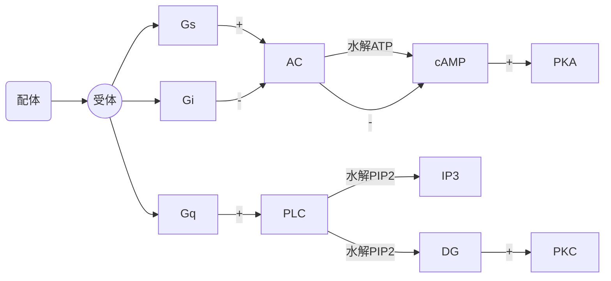
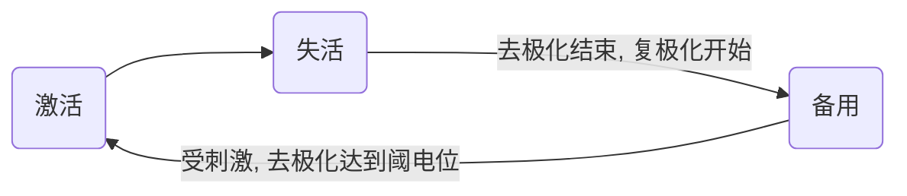

<!--
  original_source: main.md
  h1_title: 细胞的基本功能
-->
# 细胞的基本功能
## 细胞膜的结构和物质转运功能
### 物质的转运方式
#### 概述
- 单纯扩散
+ 对象: 脂溶性小分子
+ 影响因素: 分子大小、带电量
- 膜蛋白介导的跨膜转运
+ 易化扩散
* 经载体
- 对象: 葡萄糖、氨基酸、核苷酸
- 特点: 饱和现象、结构特异性、竞争性抑制
* 经通道
- 对象: 带电离子
- 特点: 离子选择性、门控特性
+ 主动转运
* 原发性 (离子泵/ATPase)
* 继发性
+ 同向转运
+ 逆向转运
- 入胞/出胞  
#### Na-K ATPase
- 特点
+ 激活条件: 胞内$Na^+$升高/胞外$K^+$升高
+ 1分子ATP = 3$Na^+$出 & 2$K^+$入
+ 生电性泵
+ 特异性抑制剂：哇巴因
+ 胞内浓度
- 钾: 细胞外液 30 倍
- 钠: 细胞外液 12 倍
+ 消耗能量：20% - 30%
- 生理意义
+ 造成膜内外$Na^+$浓度差, 形成势能储备
+ 造成细胞内$K^+$浓度高, 维持体内代谢反应
+ 进出离子数不相等, 维持细胞正常形态和渗透压
+ 是生物电活动产生前提  
#### 钙泵  
1. 钙泵活动
- 质膜 (PMCA): 1 ATP - 1 Ca2+
- 肌质网、内质网 (SERCA): 1 ATP - 2 Ca2+  
## 细胞的跨膜信号转导
受体: 靶细胞中能与配体专一结合的分子, 其本质是蛋白质  
### G蛋白耦联受体介导的信号转导
1. 第一信使定义: 胞外化学物质 (激素、神经递质、细胞因子)  
2. 第二信使定义: 第一信使作用于细胞膜后产生的细胞内信号分子.
(cAMP, cGMP, $IP_3$, DG, $Ca^{2+}$)  
1. G 蛋白效应器：腺苷酸环化酶 (AC)、磷脂酶 C (PLC)、磷脂酶 A2 ($PLA_2$)、磷酸二酯酶 (PDE)、钙或钾通道  
3. AC途径  

### 酶耦联受体介导的信号转导
1. 分类:酪氨酸激酶受体、鸟苷酸环酶受体  
## 细胞的生物电现象  
### 静息电位
1. 静息电位定义: 细胞在未受刺激时存在于细胞膜两侧的电位差  
2. 产生机制: 主要是$K^+$外流
- $K^+$外流动力: 细胞内高$K^+$浓度
- $K^+$外流条件: 细胞膜对$K^+$具有通透性  
3. $K^+$的平衡电位(能斯特方程)  
4. 影响因素:
- 细胞外$K^+$离子浓度
- 细胞膜对$K^+$, $Na^+$通透性
- Na-K泵活动水平  
5. 特异性$K^+$通道阻断剂: 四乙胺  
### 动作电位
1. 动作电位定义: 可兴奋细胞受到阈上刺激, 刺激处细胞膜两侧出现的快速可逆的电位变化  
2. 产生机制: 主要是$Na^+$外流  
3. 动作电位特点:
- 全或无
- 可传播性  
4. AP膜电位变化: 极化、去极化、复极化、超极化
- 锋电位
+ 升支: $Na^+$通透性突然增加, 形成$Na^+$内向电流, 达到超射顶点关闭
* $Na^+$外流动力: 细胞外高$Na^+$浓度
* $Na^+$外流条件: 细胞膜$Na^+$通道大量开放
+ 降支: $K^+$通透性增加, 形成$K^+$外向电流
* $K^+$外流动力: 细胞内高$K^+$浓度
* $K^+$外流条件: 细胞膜对$K^+$具有通透性
- 后电位
+ 负后电位
* 复极时$K^+$蓄积在膜外侧附近, 暂时阻碍$K^+$外流 + 正后电位
* 生电性Na-K泵作用导致超极化  
5. 阈值: 引起细胞产生AP所需最小刺激强度
- 阈上刺激
- 阈下刺激  
6. 阈电位: 由阈刺激引起的膜内电位去极化达到引发AP产生的临界值  
7. 特异性$Na^+$通道阻断剂: 河豚毒素  
8. 产生机制
+ 电化学驱动力
- 内向电流: 正电荷从膜外进入膜内
- 外向电流: 正电荷从膜内进入膜外  
9. $Na^+$电流再生性循环(正反馈):  

$Na^+$通道形态:  

### 局部电位
1. 定义: 阈下刺激使膜产生紧张电位, 使受刺激的局部产生较小的膜去极化反应.  
2. 特点:  
|  特点  |     局部电位     |     动作电位     |
|:------:|:----------------:|:----------------:|
|刺激强度|     阈下刺激     |     阈上刺激     |
| Na通道 |    配体门控型    |    电压门控型    |
|电位产生|      全或无      |     非全或无     |
| 不应期 |        无        |        有        |
|  总和  |        有        |        无        |
|传播方式|电紧张扩布 (衰减) |局部电流 (不衰减) |  
|   \    |神经纤维(AP)|神经-骨骼肌接头(局部电位)|
|:------:|:----------:|:-----------------------:|
| 方向性 |    双向    |          单向           |
|  速度  |     快     |           慢            |
|局部电位|     无     |        终板电位         |
|  疲劳  |    不易    | 易疲劳,易受环境药物影响 |
|  传递  |    1:n     |           1:1           |  
### AP的产生  
|   周期   |    电位    | 兴奋性 |
|:--------:|:----------:|:------:|
|绝对不应期| 锋电位降支 |   无   |
|相对不应期|负后电位前部|逐渐恢复|
|  超常期  |负后电位后部|  略高  |
|  低常期  |  正后电位  |  略低  |  
### AP的传导
1. 方式: 局部电流  
## 肌细胞的收缩  
### N-M接头处兴奋传递
1. 结构: 运动神经末梢 + 骨骼肌细胞
2. 传递: AP --> 神经末梢 --> $Ca^{2+}$通道开放 --> 突触小泡中ACh量子释放
--> ACh与终板膜上配体门控型$Na^+$通道特异性结合 --> 终板膜去极化
--> 形成终板电位 --> 电紧张扩布 --> 临近肌细胞膜产生AP
--> ACh酶分解ACh  
### 横纹肌细胞收缩
1. 肌管系统
- 横管(T管)
- 纵管 (肌质网/L管)
- 三联管 (横管+终池(纵管膨大))
1. 肌丝滑行学说
- 组成
+ 粗肌丝
* 肌球蛋白 (含横桥)
+ 细肌丝
* 肌动蛋白
* 原肌凝蛋白
* 肌钙蛋白 (含亚单位C、I、T)
- 功能
+ **横桥**
* 有肌动蛋白结合位点
* 头部有ATP酶活性
+ 原肌球蛋白: 位阻效应
- 肌肉收缩过程: 肌细胞兴奋 --> 三联管处兴奋 --> 收缩耦联
--> 终池释放Ca+ --> Ca+与肌钙蛋白结合 --> 原肌凝蛋白变构
--> 肌动蛋白结合位点暴露 --> 肌球蛋白结合肌动蛋白
--> 肌球蛋白分解ATP, 变构, 肌丝滑动 --> 肌节缩短
- 别名
- 肌动蛋白: 肌纤蛋白
- 肌球蛋白: 肌凝蛋白  
### 横纹肌兴奋-收缩耦联
1. 收缩过程: 肌细胞膜AP --> 横管 --> 三联管 --> L型钙通道
--> 终池$Ca^{2+}$释放 --> 胞质$Ca^{2+}$浓度上升 --> $Ca^{2+}$与肌钙蛋白结合
2. 舒张过程: 肌质网Ca泵作用 --> 胞质$Ca^{2+}$浓度下降 --> 肌肉舒张  
### 影响横纹肌收缩效能的因素
1. 负荷
- 前负荷: 收缩前承受负荷，与粗细肌丝重叠面积相关
- 后负荷: 收缩后承受负荷，与缩短速度相关
2. 肌收缩能力: 主要取决于$Ca^{2+}$水平与横桥ATP酶活性
3. 收缩的总和
- 数量的总和: 参与收缩的运动单位
- 频率的总和
+ 单收缩
+ 不完全强直收缩
+ 完全强直收缩