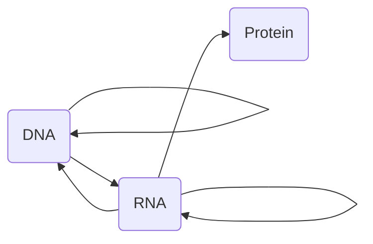

<!--
  original_source: main.md
  h1_title: 遗传信息的传递
-->
# 遗传信息的传递
## 概述
0. 中心法则  

0. 基因: 编码蛋白质或RNA等具有特定功能产物的、负载遗传信息的基本单位.
- 顺式作用元件 (基因的调控区)
+ 增强子
+ 启动子
- GC盒
- CAAT盒
- TATA盒
+ 翻译起始点 (ATG)
- 结构基因
+ 编码序列 (外显子) <!--TODO: Add def-->
+ 调控序列和间隔序列 (内含子)
+ 修饰点 (AATAAA)
0. 沉默子  
0. 转录和复制的相同点 <!--IMPORTANT--> <!--IMPORTANT-->
0. 转录和复制的区别 <!--IMPORTANT--> <!--IMPORTANT-->  
## 真核基因与基因组
0. 基因组: 一个生物体内所有遗传信息的总和  
## DNA的生物合成
### DNA复制的基本特征
0. DNA复制: 以DNA为模板合成DNA的过程
0. 基本特征
- 半保留
+ 定义: DNA合成时, 双链DNA解链为单链, 以各单链为模板, 合成DNA的过程.
+ 意义: 子代保留亲代的全部遗传物质, 体现遗传的保守性
- 半不连续性 <!--IMPORTANT-->
+ 定义: 复制叉两条模板链方向相反, 但DNA合成方向总是由3'-5',
因而一条链合成时形成许多不连续片段, 最后连成一条完整的DNA链的过程.
0. 复制子: 两个相邻起始点间的距离. 是独立完成复制的功能单位.  
### DNA复制的酶学和拓扑学变化
0. 参与DNA复制的物质
- 底物: dNTP
- DNA聚合酶 (DNApol)
- 模板
- 引物
- 酶和蛋白质因子
0. 特点
- 新链延长从5' -> 3'
0. DNA聚合酶
- 原核生物
+ 活性
- 5' -> 3' 聚合酶的活性
- 核酸外切酶活性
+ 分类
- DNA-pol I: 主要为修复作用
- DNA-pol II: DNA损伤的应急修复
- DNA-pol III: 主要为聚合作用  
|   DNA聚合酶   |       作用       |I |II|III|
|---------------|------------------|--|--|---|
|5'-3'聚合酶活性|催化生成磷酸二酯键|有|有|有 |
|5'-3'外切酶活性|切除引物、突变片段|有|无|无 |
|3'-5'外切酶活性|       校对       |有|有|有 |  
- 真核生物
+ 分类
- DNA-pol α: 引物酶活性
- DNA-pol β:
- DNA-pol γ: 催化线粒体 DNA 复制
- DNA-pol δ: **延长子链的主要酶**, 有解螺旋酶活性
- DNA-pol ε: 修复作用  
0. DNA复制的保真性
- 碱基互补配对
- DNA-polIII 在复制延长中对碱基的选择功能
- 复制出错时DNA-polI有校对功能
0. 原核生物复制起始的相关蛋白质  
|  蛋白质  |    通用名     |      功能      |
|:--------:|:-------------:|:--------------:|
|   DnaA   |   解螺旋酶    |   辨认起始点   |
|   DnaB   |   解螺旋酶    |  解开DNA双链   |
|   DnaC   |               | 运送和协同DnaB |
|   DnaG   |    引物酶     |催化RNA引物生成 |
|   SSB    |单链DNA结合蛋白|稳定已解开的单链|
|拓扑异构酶|               |   理顺DNA链    |  
### DNA的生物合成
0. **引发体**: 解螺旋酶、DnaC蛋白、引物酶和DNA复制起始区域的复合结构
0. 逆转录: RNA变化为DNA的过程
0. 过程
- 解螺旋酶解螺旋
- SSB稳定解开的单链DNA
- 引物酶合成引物
- DNA复制起始
0. 端粒
- 定义: 真核生物染色体线性DNA分子末端的结构
- 特点
+ 末端DNA序列和蛋白质构成
+ 末端DNA序列是多次重复的富含TG碱基的短序列  
## DNA损伤与修复
### DNA损伤
0. 引发突变的因素
- 自身因素
+ DNA复制错误
+ DNA自身的不稳定性
+ 机体代谢过程产生活性氧
- 体外因素
+ 物理因素: 电磁辐射、紫外线
+ 化学因素: 变质食品、亚硝酸盐、烷基化物等
+ 生物因素: 病毒
0. 嘧啶二聚体 (TT) : 紫外光照射下相邻两个胸腺嘧啶连接
0. DNA损伤类型
- 碱基置换 (镰刀型红细胞贫血症)
- 缺失和插入
- 重组或重排
0. **移码突变**: 缺失或插入核苷酸的突变, 引起三联密码阅读方式的改变  
### DNA修复
0. 定义: 使已发生的DNA分子改变回复其原有的自然状态
0. 修复方式
- 直接修复
+ 嘧啶二聚体 (光聚合酶)
+ 烷基化碱基 (甲基转移酶)
+ 无嘌呤位点
+ 单链断裂
- 碱基切除修复 (最普遍修复方式) <!--IMPORTANT-->
+ 过程
* [DNA糖基化酶]识别水解, 产生无碱基位点 (AP位点)
* [AP内切酶]切除剩余磷酸核糖
* [DNA聚合酶]合成核苷酸
* [DNA连接酶]连接
- 核苷酸切除修复 (NER) <!--IMPORTANT-->
- 特点: 识别DNA双螺旋变形
- 过程
* 识别
* 解链
* 去除
* 合成
- 缺陷: 遗传性着色干皮病  
### DNA损伤和修复的意义
0. DNA损伤的后果
- DNA突变
- DNA失去复制或转录的模板的功能  
## RNA的生物合成
0. 转录产物: 见[RNA](#RNA的结构及功能)
0. 合成方式
- DNA指导的RNA合成 (转录)
- RNA指导的RNA合成 (多见于病毒)
0. 合成方向: 5' -> 3'
0. 转录参与物质
- 原料: NTP
- 模板: DNA
- 酶: 主要为RNA聚合酶
- 其他蛋白质因子  
### 转录的模板和酶
0. 结构基因: DNA分子上转录出RNA的区段
0. 转录模板
- 特点: 不对称转录 <!--IMPORTANT-->
+ DNA分子双链上某一区段只有一股链作为模板指引转录.
+ 模板链并非总在同一条单链上 (分为模板链和编码链 (反义链/Crick链)
0. RNA聚合酶
- 原核生物
+ 组成 (全酶) :α₂ββ'σ
* 核心酶: α₂ββ'
* σ亚基: 辨别转录起始点
- 真核生物
0. 操纵子: 原核生物一个转录区段可视为一个转录单位, <!--IMPORTANT-->
包括多个结构基因及其上游的调控序列, 称为操纵子.
0. 启动子: RNA聚合酶结合模板DNA的部位, 也是控制转录的关键部位
- 功能部位
+ +1 区: 转录的起始部位
+ -10 区: 结合部位 (核心酶, 富含AT)
+ -35 区: 起始部位 (σ亚基)  
### 转录过程
0. 转录起始
- RNA聚合酶结合启动子, 形成闭合转录复合体
- DNA双链打开, 形成开放转录复合体 (-10bp左右解开17bp左右)
- RNA聚合酶作用下形成第一个磷酸二酯键 (四磷酸二核苷酸)  
5'-pppG-OH + NTP --> 5'-pppG-pN-OH + ppi  
0. 转录延长
- σ亚基脱落, RNA-pol聚合酶变构成疏松态
- RNA聚合酶移动, 进行转录
0. 转录终止
- 定义: RNA聚合酶在终止子处停顿下来不再前进, 转录产物从转录复合物脱落.
- 依赖于ρ因子的转录终止
+ ρ因子
* 相同亚基组成的六聚体
* 对polyC结合能力较强
* 有ATP酶活性
- 非依赖于ρ因子的转录终止
0. 转录终止的加尾修饰
- 转录终止的修饰点: 共同序列AATAAA, 下游富含GT  
0. 转录空泡: RNA聚合酶所在区, 有17个碱基解链, 12个碱基DNA-RNA杂交链, 前后DNA都是双链 <!--IMPORTANT-->
0. 转录因子 (反式作用因子)  
### 真核生物RNA的加工和降解
0. 主要的修饰方式
- 剪接
- 剪切
- 修饰
- 添加
- RNA编辑
0. 过程弱
- [加帽酶] 5'末端添加7-甲基鸟嘌呤核苷酸
- 加尾: tRNA 3'段加-CCA尾
- 剪接: 两次转酯反应
- RNA编辑  
## 蛋白质的生物合成
### 基本概念
0. 翻译: 以新生的mRNA为模板, 把核酸中由AGCU四种符号组成的遗传信息破译为氨基酸的排列顺序的过程.
0. 开放阅读框架: 以AUG为起始密码子至终止密码子的核苷酸序列, 是合成蛋白质的密码子的表达区域.  
### 蛋白质生物合成体系
0. 模板: mRNA
0. 原料: 20种编码氨基酸
- 密码子: 在mRNA的开放阅读框内以酶三个相邻的核苷酸为一组,
代表一种氨基酸, 这种三联体形式的核苷酸序列称为密码子.
+ 起始密码子: AUG
+ 终止密码子: UAA、UAG、UGA
- 遗传密码的特点 <!--IMPORTANT-->
+ 方向性: 5' -> 3'
+ 连续性
+ 简并性: 除Trp和Met(AUG)只有一种密码子, 其他都有多种密码子.
+ 摆动性: 反密码子与密码子配对规则有时并不严格遵守
常见的碱基配对规律 (第一位次黄嘌呤I 配对 U,C,A)
+ 通用性
0. 氨基酸运载体: tRNA
0. 场所: 核蛋白体 (核糖体)
0. 酶
- 氨基酰-tRNA合成酶
- 转肽酶
- 转位酶
0. 蛋白质因子: IF、EF、RF
0. 能量 (ATP、GTP)
0. 无机离子 (Mg²⁺、K⁺)  
### 氨基酸与tRNA的连接
0. 核糖体 (核蛋白体)
- 构成:
- 亚基 <!--TODO: Add Table-->
- 位点
+ A位 (氨基酰位)
+ P位 (肽酰位)
+ E位 (原核生物: 排出位)
- 酶类
+ 氨基酰tRNA酶
+ 转肽酶
+ 转位酶
- 蛋白质因子
+ 起始因子
+ 延长因子
+ 释放因子  
### 蛋白质合成过程
0. 氨基酸活化: 氨基酸 + ATP + tRNA -- 氨基酰tRNA合成酶 --> 氨基酰tRNA + AMP + PPi
- aa + ATP --> aa-AMP + PPi
- aa-AMP + tRNA --> aa-tRNA + AMP (tRNA-CCA-3')  
0. 起始肽链合成的aa-tRNA
- 真核生物
+ 起始: $Met-tRNA_i^{Met}$
+ 普通: $Met-tRNA^{Met}$
- 原核生物
+ 起始: $fMet-tRNA^{fMet}$  
### 肽链生物合成的过程
<!--IMPORTANT-->  
0. 翻译的起始
- 定义 <!--TODO: Add-->
- 蛋白质因子: 起始因子IF
- 过程 (原核生物)
+ 核糖体亚基分离 (IF-1 IF-3)
+ 小亚基识别 **S-D 序列**，结合**核糖体结合位点 (RBS)** (AUG对应P位)
+ $fMet-tRNA^{fMet}$ 结合 (IF-2 GTP)
+ GTP水解, IF脱落, 大小亚基结合形成起始复合物
- 过程 (真核生物)
+ 核糖体亚基分离
+ $Met-tRNA_i^{Met}$ 结合
+ 小亚基结合mRNA (AUG对应P位)
+ 大小亚基结合形成起始复合物
0. 翻译的延长 (核糖体循环)
- 定义: 翻译延长过程中进位、成肽、转位的过程
- 蛋白质因子: 延长因子EF
- 过程
+ 进位/注册 (EF-T催化aa-tRNA进入A位)
+ 成肽 (转肽酶)
+ 转位 (EF-G 核糖体前移)
0. 翻译的终止
- 蛋白质因子: 释放因子RF
+ 识别终止密码子
+ 诱导转肽酶改变为酯酶活性
- 过程  
0. SD序列: 起始密码子上游以AGGA为核心的序列 (核糖体结合位点RBS) <!--IMPORTANT-->
0. 多聚核糖体: 一条mRNA模板链结合10-100核糖体的复合物  
### 蛋白质的折叠和加工输送
0. 翻译后修饰: 肽链从核糖体释放后经过细胞内修饰处理成为有活性蛋白质的过程
- 蛋白质辅助修饰
+ 分子伴侣
+ 蛋白质二硫键异构酶
+ 肽-脯氨酰多肽异构酶
- 多肽链水解修饰
- 蛋白质化学修饰
+ 肽链末端的修饰
+ 个别氨基酸的共价修饰
- 空间结构修饰
+ 亚基聚合
+ 辅基连接
+ 疏水脂链的共价连接
0. 蛋白质合成后的靶向运输 (分选)
0. 信号肽区段
- 碱性N-末端
- 疏水核心区
- 加工区  
### 蛋白质生物合成和抑制
0. 抗生素 <!--TODO: Add def-->
0. 干扰素 (IFN)
- 定义: 真核细胞被病毒感染后分泌的一类具有抗病毒作用的蛋白质, 可抑制病毒的繁殖.
- 作用机理
+ 诱导IF-2磷酸化而失活
+ 诱导病毒RNA降解  
## 基因表达调控
### 基本概念
0. 基因表达: 基因经过转录翻译, 产生具有特异生物学功能的RNA或蛋白质分子的过程.
- 时间特异性
- 空间特异性 (细胞/组织特异性)
0. 基因表达调控: 生物体内基因表达的开启、关闭和表达强度的直接调节
0. 基因表达的方式
- 基本表达 (组成性表达)
+ 管家基因: 较少受环境因素影响, 在个体几乎所有细胞中持续表达
* GAPDH (3-磷酸甘油醛脱氢酶)
* β-actin (β-肌动蛋白)
* 18s rRNA
- 诱导和阻遏表达
+ 诱导基因: 在特性环境信号刺激下被激活, 引起基因表达产物增加的基因. 激活的过程称为诱导
+ 阻遏基因: 在特性环境信号刺激下被激活, 引起基因表达产物减少的基因. 激活的过程称为阻遏
- 协调表达: 在一定机制控制下, 功能相关的基因共同表达.
0. 真核生物基因表达的调节
- 顺式作用元件: 位于基因转录区前后、对基因表达起调控作用的区域 (旁侧序列)
+ 增强子
+ 启动子
* GC盒
* CAAT盒
* TATA盒
+ 翻译起始点 (ATG)
- 反式作用因子: 某一基因表达产生的能与另一基因顺式作用元件作用 (反式作用),
调节基因表达的蛋白质因子.
+ 作用方式: 非共价结合为主. 反式作用因子可为蛋白质二聚体或多聚体
0. 基因表达调控点
- 基因激活: 通过改变基因组中有关基因的数量、结构顺序和活性控制基因表达 <!--IMPORTANT-->
+ 机制: 基因扩增、重排、化学修饰
- 转录起始
- 转录后修饰
-  (转录产物转运)
- 翻译
- 翻译后加工  
### 原核生物基因转录调节
0. 主要环节: 转录起始
0. 操纵子
- 调控序列
+ 其他调节序列: CAP (代谢物基因激活蛋白) 等
+ 启动子
+ 操纵序列: 结合阻遏蛋白, 阻碍RNApol结合启动序列或向前移动
- 结构基因 (数个)
+ 编码序列 (外显子)
+ 非编码序列 (内含子)
0. 调节蛋白
- 特异因子: ρ因子等
- 阻遏蛋白
- 激活蛋白
0. 多顺反子: mRNA 分子携带了几个多肽链的编码信息.  
0. 乳糖操纵子
- 结构
+ I: 调节基因
+ CAP结合位点
+ P: 启动序列
+ O: 操纵序列
+ ZYA: 结构基因
- 阻遏蛋白的负性调节
+ 作用机制:
* 调节基因I表达合成阻遏蛋白与操纵序列结合
* 乳糖与阻遏蛋白结合去阻遏
- CAP的正性调节
+ 正性调节物: cAMP
+ 作用机制: 葡萄糖↓ -> cAMP↑ -> CAP-cAMP↑ -> 复合物结合CAP结合位点 -> 促进基因表达
+ 作用条件:
* 无阻遏蛋白封闭转录
* 有CAP存在  
### 真核生物基因转录调节
0. 特点
- 基因组大
- 编码基因少 (10%)
- 编码基因不连续
- 单顺反子: 一个 mRNA 分子携带一个多肽链的编码信息.
- DNA以染色质的形式存在与细胞核内
- 遗传信息存在与细胞核核和线粒体内
0. 主要环节: 转录起始
0. 顺式作用元件: 关键调节部位
- 启动子
+ 转录起始点
+ 功能组件
0. 转录因子 (反式作用因子) : 关键分子
- 分类
+ 通用转录因子
+ 特异转录因子
* 转录激活因子
* 转录抑制因子
- 结构
+ DNA结合域
+ 转录激活域
+ 蛋白质-蛋白质结合域  
## 细胞信号转导
### 概述
0. 基本路线
- 细胞外信息物质
- 靶细胞
- 受体
- 细胞内信使系统
- 产生生物学效应
0. 化学信号分类
- 可溶性 (水/脂溶性)
+ 内分泌
+ 旁分泌
+ 自分泌
- 膜结合性
0. 受体: 细胞膜上或细胞内能特异识别并结合生物活性分子的成分.
- 作用: 识别、传递信号
- 分类
+ 膜受体
* 离子通道受体
* G-蛋白耦联受体
* 单次跨膜受体
+ 细胞内受体 (与类固醇激素, 甲状腺素, 维甲酸等结合)
- 效应
+ 改变酶活性
+ 增加细胞内信使浓度变化
+ 增加转录因子
- 特点
+ 高度专一性
+ 高度亲和性
+ 可饱和性
+ 可逆性
+ 特定的作用模式  
### 细胞内信号转导相关分子
0. 信号转导分子: 细胞外信号通过受体转换进入细胞内, 进行信号传递的分子.
- 第二信使
- 酶
- 蛋白质
0. 第二信使
- cAMP->PKA
- cGMP->PKG
- DAG->PKC
- IP₃->Ca²⁺->PKC
- Ca²⁺->CaM
+ 分布特点
* 细胞外液游离钙离子浓度高
* 细胞内液钙离子浓度低
* 细胞内大部分Ca²⁺储存于细胞内钙库
+ 下游信号转导分子: CaM